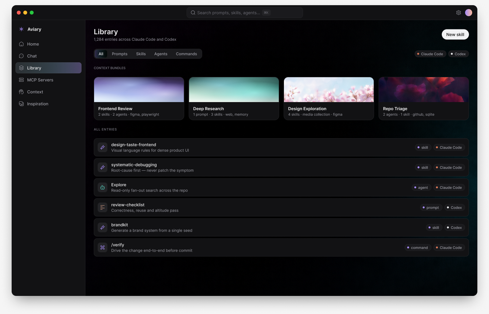
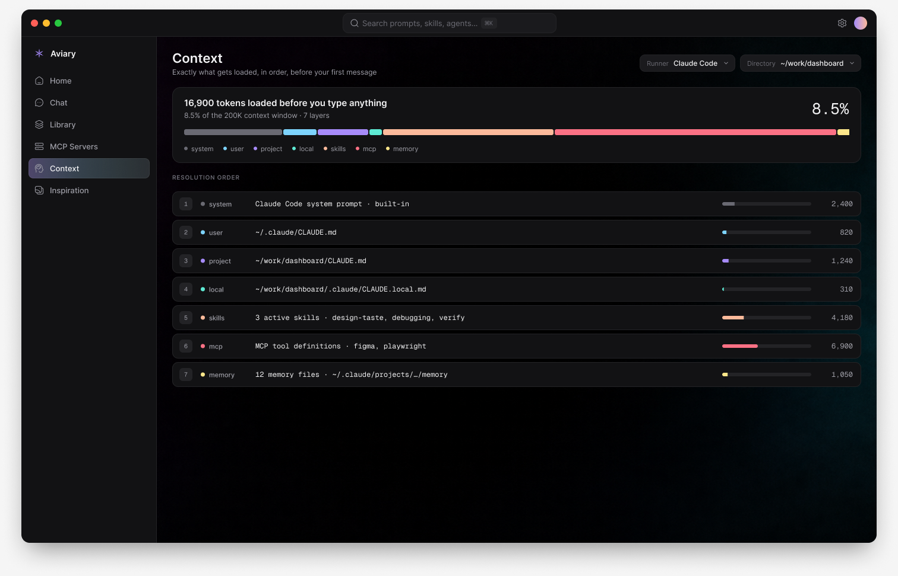
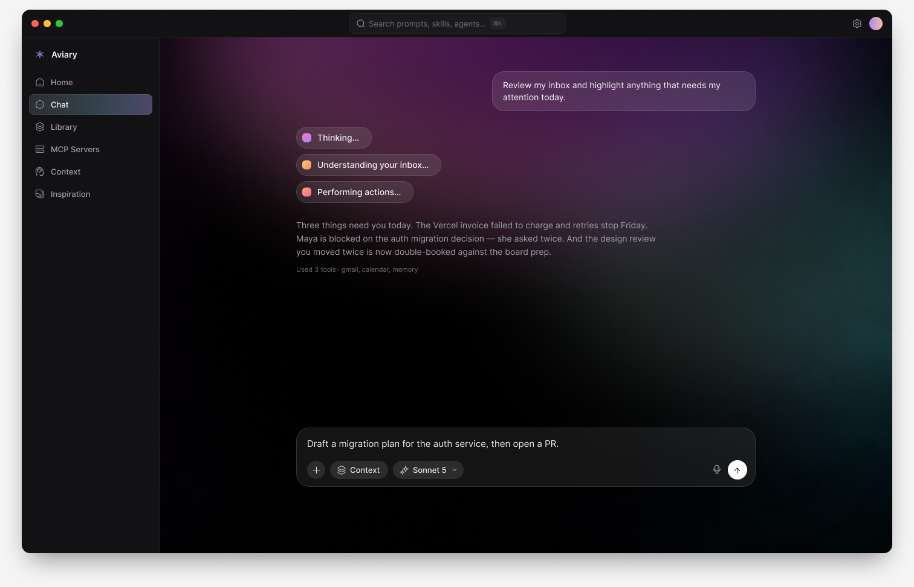
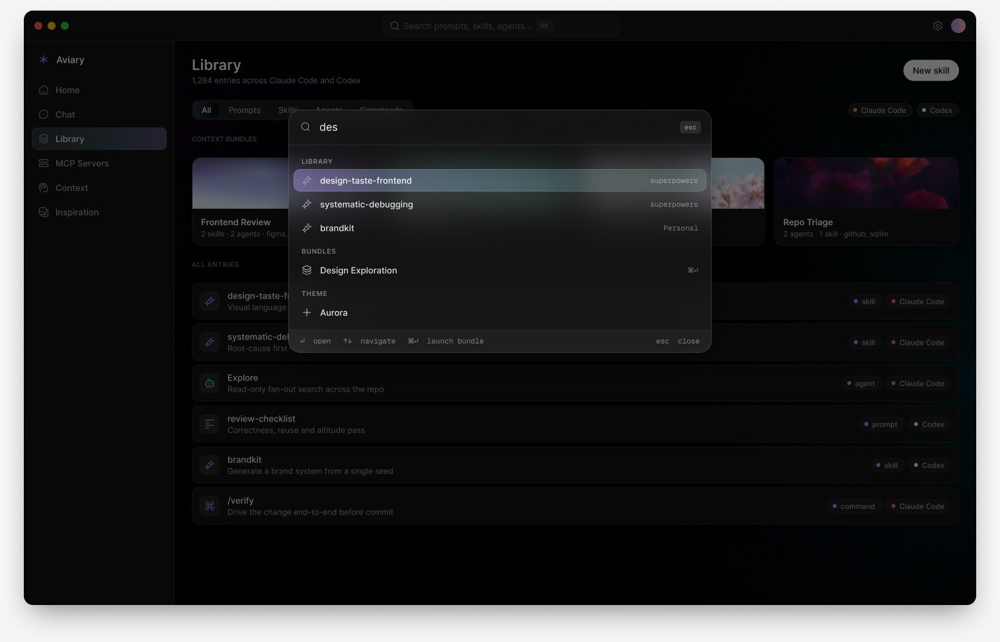

<div align="center">


# Aviary

**Your agents live in many places. Aviary is the one place you shape them.**

A local-first desktop app for managing personal AI agents — the prompts, skills,
subagents, MCP servers, context and media that Claude Code, Codex and whatever
comes next all read from.

<br />


<br />

[](https://tauri.app)
[](https://react.dev)
[](https://www.rust-lang.org)
[](https://www.typescriptlang.org)
[](https://github.com/MedSlimane/Aviary/releases)
[](https://github.com/MedSlimane/Aviary/actions)

</div>

<br />

---

## Why

Coding agents read their behaviour from files scattered across your disk —
`~/.claude/skills/`, `~/.codex/AGENTS.md`, per-project `CLAUDE.md`, MCP blocks in
three incompatible config formats, memory directories, plugin caches. The
configuration surface is large, powerful, and completely unmanaged.

Aviary is a fast, native home for that surface — **and a place to actually use
it**, not merely curate it.

<br />

## The library

Every prompt, skill, subagent and command across every runner, in one searchable
index. Grouped by the pack it ships with, so `superpowers`' fifteen skills
collapse into one row instead of scattering through the list.



Skills are not owned by a runner. They live in a shared pool and are *symlinked*
into each runner's directory — so "enabled for Claude Code" is the presence of a
symlink, not metadata. Aviary deduplicates by canonical path and reports every
runner that links to an entry.

Select one and it opens beside the list: frontmatter, rendered markdown, the
symlink target, and a real token count from `tiktoken` rather than a byte
heuristic.

<br />

## Context, finally visible

The answer to *"why did the agent do that?"* is usually "something you couldn't
see was in its context." This is the screen that shows it: every instruction,
skill and MCP tool definition that loads, in resolution order, with its real
token cost when knowable and an explicit unknown or incomplete state otherwise.
MCP schema costs appear only after a user-approved live health check.



<br />

## Chat that runs the real thing

Agentic turns are driven by the installed runner's own machine-readable CLI
protocol, so tools, skills, permissions and real session resume stay with the
runner. Sessions and normalized events persist locally, permission requests are
answered in the transcript, and prompts travel over stdin rather than command
arguments. Edit a skill in Aviary and it applies on the next turn because it is
the same file.



<br />

## Everything is one keystroke away

`⌘K` searches the live library and opens the app's real navigation and theme
actions.



<br />

## Context Bundles

The idea that ties the app together. A bundle is a saved composition:

```
Bundle "Frontend Review"
  ├ prompt      review-checklist.md
  ├ skills      design-taste-frontend, web-design-guidelines
  ├ agents      Explore, code-reviewer
  ├ mcp         figma, playwright
  ├ memory      scope: ~/work/dashboard
  └ media       collection: "UI references / dark"
```

The editor stores real opaque targets and preserves missing ones without
rebinding by name. A compatible saved revision can attach to chat or launch the
real CLI in Terminal. If a runner has no proven way to represent a component,
Aviary blocks execution with the exact reason instead of pretending it applied.

<br />

## Aviary serves, it doesn't just show

Two local MCP servers expose the library back to your agents, so anything you
curate is reachable from inside Aviary *or* a bare terminal:

| Server | Tools |
|---|---|
| `aviary-library` | `search_library`, `get_skill`, `get_prompt`, `get_agent`, `list_bundles` |
| `aviary-media` | `search_media`, `get_media`, `list_collections` |

This is what makes an inspiration board useful rather than decorative — ask for
"that grainy teal gradient from my references" and the agent gets the file.

<br />

## Architecture

```
src-tauri/src/
├─ providers/      one file per runner — the blast radius for format drift
│  ├─ claude_code.rs
│  └─ codex.rs
├─ library.rs      index assembly, registered projects
├─ context.rs      resolves the instruction stack for (runner, cwd)
├─ mcp.rs          static inventory and explicit bounded health checks
├─ mcp_protocol.rs shared bounded MCP JSON-RPC lifecycle
├─ media.rs        content-addressed media store, thumbnails, auto-tagging
├─ mcp_media.rs    read-only aviary-media tools
├─ mcp_library.rs  read-only aviary-library tools
├─ launch.rs       private one-use Terminal handoff
├─ bin/            media, library and launch helper entry points
├─ runner.rs + runner/  CLI supervisor and protocol adapters
├─ models.rs       model + effort discovery, per runner
├─ store.rs + store/    SQLite, durable sessions and bundles
├─ watcher.rs      debounced native filesystem refresh
├─ diagnostics.rs  bounded local logs and reports
├─ writer.rs       atomic writes, snapshots, conflict detection
└─ tokens.rs       tiktoken (o200k_base)

src/
├─ views/          home · chat · library · projects · bundles · mcp · context · inspiration · settings
├─ components/     rail, title bar, shared screen parts
├─ lib/            api (the only IPC boundary), theme, motion, notify
└─ index.css       design tokens → shadcn token bridge
```

**Runner files are the configuration source of truth.** `cache.db` is
disposable; `data.db` is durable because it owns projects, media, preferences,
chat history and Bundles. Runner-config writes are atomic, snapshotted to
`~/.aviary/history` first, and refused if the file changed underneath you.

**Performance is a contract, not an aspiration.** Filesystem walks, tokenising,
hashing and subprocess work stay off the UI thread. Frames, subprocess output,
diagnostics and stored events are bounded. Live `backdrop-filter` is limited to
small transient surfaces; card "glass" is a pre-rendered texture.

<br />

## Design system

Five colour modes, all driven by the same 24 semantic variables. The Figma file
is the source; `src/index.css` aliases shadcn's token names onto them, so every
shadcn component inherits the design system rather than being restyled.

| Mode | |
|---|---|
| **Dark** | near-black working surface, the default |
| **Light** | neutral daylight |
| **Aurora** | violet-cast dark |
| **Ember** | warm dark |
| **Paper** | warm cream light |

Icons are [HugeIcons](https://hugeicons.com). Type is Inter and Geist Mono.

<br />

## Getting started

```bash
# Requires Rust and Bun
cd aviary
bun install
bun run tauri dev
```

```bash
bunx tsc --noEmit                  # typecheck the frontend
cd src-tauri && cargo test --lib   # includes real-machine integration coverage
cargo build --bins                 # app plus all bundled helpers
./scripts/make-dmg.sh              # universal DMG — see docs/RELEASING.md
```

<br />

## Status

**[`v0.1.0-alpha.1`](https://github.com/MedSlimane/Aviary/releases/tag/v0.1.0-alpha.1)**
is the latest published build. It is ad-hoc signed and not notarised. The source
tree contains later P1–P4 work, but the signed updater path is not complete until
a real public old-version-to-new-version release passes the checks in
[`docs/RELEASING.md`](docs/RELEASING.md).

Every surface below reads your real machine. **There is no mock data in the app.**

| | |
|---|---|
| Library — discovery, dedupe, editor with write safety | ✅ |
| Projects — auto-discovery, opt-in tracking | ✅ |
| MCP servers — sanitized inventory, explicit health, safe toggles | ✅ source |
| Chat — durable resume, permissions, structured tools | ✅ source |
| Context — complete/partial measurements with honest unknowns | ✅ source |
| Inspiration — content-addressed media board, auto-tagging | ✅ |
| `aviary-media` and `aviary-library` MCP servers | ✅ source |
| Context Bundles and private Terminal handoff | ✅ source, fail-closed compatibility |
| File watching and local diagnostics | ✅ source |
| Signed updater and notarised public release | ⏳ external release proof |

The full plan is in **[`docs/ROADMAP.md`](docs/ROADMAP.md)**.

<br />

## Repository

```
aviary/        the app
ios/           SwiftUI companion prototype — designed, not shipped
assets/        brand, textures, generated floral photography, tokens
docs/          architecture, roadmap, release runbook, design spec
```

| Document | |
|---|---|
| [`docs/ARCHITECTURE.md`](docs/ARCHITECTURE.md) | How it is put together, and why |
| [`docs/ROADMAP.md`](docs/ROADMAP.md) | Scheduled implementation status and deliberately unscheduled work |
| [`docs/RELEASING.md`](docs/RELEASING.md) | Fail-closed signed release runbook |
| [`CONTRIBUTING.md`](CONTRIBUTING.md) | Setup, and what gets a change rejected |
| [`CLAUDE.md`](CLAUDE.md) | Rules for agents working in this repo (`AGENTS.md` symlinks here) |
| [design spec](docs/superpowers/specs/2026-07-28-aviary-design.md) | Original rationale, risks and phasing |

<br />

---

<div align="center">
<sub><b>Aviary</b> is a placeholder name and mark.</sub>
</div>
